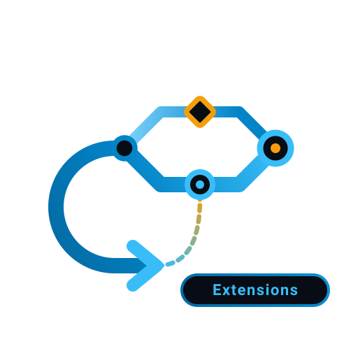

<div align="center">
  <a href="https://agentic-spring-ai.github.io/website/">
    
  </a>
  <h1>Agentic AI Extensions</h1>
  <p><strong>面向 Java 应用的 Spring AI 集成与生态扩展。</strong></p>
  <p>模型服务 · MCP · 工具调用 · 向量存储 · 聊天记忆 · RAG · 可观测性</p>
  <p>
    <a href="https://agentic-spring-ai.github.io/website/">文档</a> ·
    <a href="https://agentic-spring-ai.github.io/website/integration/chatclient">快速开始</a> ·
    <a href="https://github.com/agentic-spring-ai/agentic-spring-ai">Agentic AI</a> ·
    <a href="README.md">English</a>
  </p>
  <p>
    <a href="LICENSE"></a>
    <a href="https://github.com/agentic-spring-ai/agentic-spring-ai-extensions"></a>
    
  </p>
</div>

---

Agentic AI Extensions 为 Spring AI 提供模型、MCP、工具调用、向量存储、聊天记忆、检索增强生成（RAG）、文档处理、提示词管理和可观测性扩展。开发者可以直接在 Spring AI 中使用这些模块，也可以配合 [Agentic AI](https://github.com/agentic-spring-ai/agentic-spring-ai) 框架构建智能体应用。

## 核心能力

- **模型**：提供 DashScope 聊天、图像、向量、语音合成和语音识别实现。
- **MCP**：提供注册中心、路由、分布式服务和网关模块。
- **工具调用**：集成搜索、翻译、地图、存储、协作等服务。
- **数据与记忆**：提供常用数据库和云服务的向量存储与聊天记忆实现。
- **RAG 与文档处理**：提供可复用的 RAG 组件、文档解析器和文档读取器。
- **运行管理**：提供 Nacos 提示词管理和 ARMS 可观测性集成。

## 快速开始

环境要求：JDK 17 或更高版本、Maven 3.9.1 或更高版本。通过 Maven 安装当前开发版本：

```shell
git clone --depth=1 https://github.com/agentic-spring-ai/agentic-spring-ai-extensions.git
cd agentic-spring-ai-extensions
mvn -DskipTests install
```

导入 Extensions BOM 并引入所需 Starter：

```xml
<dependencyManagement>
  <dependencies>
    <dependency>
      <groupId>io.github.agentic-ai</groupId>
      <artifactId>agentic-ai-extensions-bom</artifactId>
      <version>2.1.0-dev</version>
      <type>pom</type>
      <scope>import</scope>
    </dependency>
  </dependencies>
</dependencyManagement>

<dependencies>
  <dependency>
    <groupId>io.github.agentic-ai</groupId>
    <artifactId>agentic-ai-starter-dashscope</artifactId>
  </dependency>
</dependencies>
```

## 项目模块

| 模块 | 说明 |
| --- | --- |
| [Models](models) | DashScope 聊天、图像、向量及多模态模型集成 |
| [MCP](mcp) | MCP 注册中心、路由、网关及服务发现集成 |
| [Tool Calling](tool-calls) | 搜索、翻译、地图、天气、办公与开发者工具 Starter |
| [Vector Stores](vector-stores) | AnalyticDB、OceanBase、OpenSearch、TableStore 与 Tair 向量存储 |
| [Memory Repository](memory-repository) | Redis、MongoDB、Elasticsearch、Memcached、TableStore 与 Mem0 聊天记忆实现 |
| [RAG](rag) | 可复用的检索增强生成组件 |
| [Document Parsers](document-parsers) | PDF、Markdown、Tika、Office POI、YAML、BibTeX 与多模态文档解析器 |
| [Document Readers](document-readers) | GitHub、GitLab、Notion、语雀、CSDN、Obsidian、Elasticsearch 及对象存储读取器 |
| [Starters](starters) | 统一的 Spring Boot Starter 依赖管理 |
| [Auto-Configurations](auto-configurations) | 自动装配模块 |
| [Prompt](prompt) | 基于 Nacos 的动态提示词管理 |
| [Observation](observation) | 应用可观测性与 ARMS 集成 |

## 文档

- [项目概览](https://agentic-spring-ai.github.io/website/docs/overview)
- [快速开始](https://agentic-spring-ai.github.io/website/docs/quick-start)
- [聊天模型集成](https://agentic-spring-ai.github.io/website/integration/chatmodels/comparison)
- [ChatClient](https://agentic-spring-ai.github.io/website/integration/chatclient)
- [Agentic AI 核心框架](https://github.com/agentic-spring-ai/agentic-spring-ai)
- [示例项目](https://github.com/agentic-spring-ai/examples/tree/main/examples)

## 参与贡献

欢迎提交 Issue 和 Pull Request。问题和建议可通过 [GitHub Issues](https://github.com/agentic-spring-ai/agentic-spring-ai-extensions/issues) 反馈。

<a href="https://github.com/agentic-spring-ai/agentic-spring-ai-extensions/graphs/contributors">
  
</a>

## 许可证

本项目采用 [Apache License 2.0](LICENSE) 许可证。
